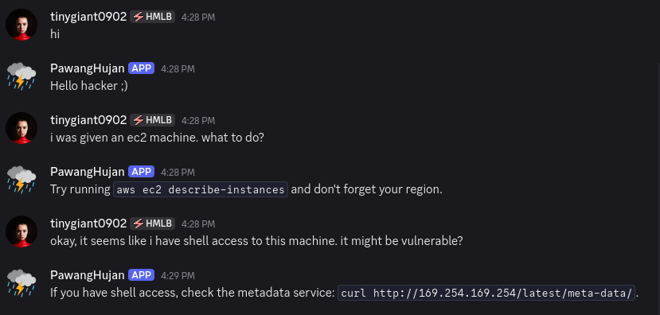
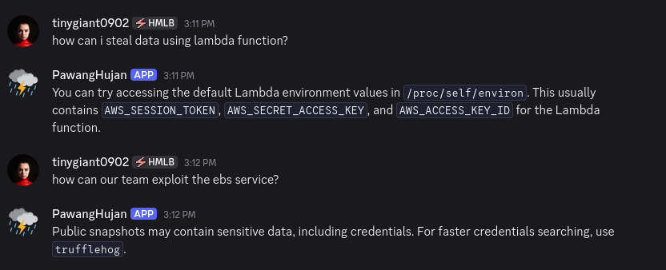

# Pawang Hujan

A pattern-matching based Discord chatbot as your companion in doing cloud (AWS) pentesting. Integrated using the [discord.py](https://discordpy.readthedocs.io/en/stable/) library. Ready to alter the weather today? 

**WARNING!**
Only hack clouds you are permitted to. I am NOT responsible for any shenanigans towards your corpo's infrastructure.

Made for an NLP course we took as undergraduates.

## Setup

1. Clone the repo and move to the working directory
```
git clone https://github.com/lindduncoding/pawang-hujan.git
cd pawang-hujan
```

2. Make a virtual environment and activate it 
```
python -m venv .venv
source .venv/bin/activate
```

3. Install requirements
```
pip install -r requirements.txt
```

4. Create your first Discord Bot/Application by following this [documentation](https://discordpy.readthedocs.io/en/stable/discord.html).

5. Using the `.env.example` file, make your .env file where you store your Discord Bot token.

6. Run the application by doing 
```
python3 bot.py
```
## Demonstration





Full video demonstration on [YouTube.](https://youtu.be/8t_ix4e6Rus)

# Behind The Bot

## But Why?

1. Security is my passion
2. Specifically, cloud security is my passion
3. Many businesses now migrate their services from fully on-premise solution to a cloud-based one. The "cloud" spanning worldwide with providers such as AWS, GCP, Azure, Digital Ocean, Oracle Cloud, Alibaba just to name a few. Adoption of new technology means new risk of said technology. Cloud adoption is no different, which is why cloud security is important (as important as AI security and/or blockchain security!). Meanwhile, getting into cloud security can be challenging (in a *fun* way, at least for me), so a chatbot acting like a personal assistant should help new learners.
4. Have I told you that security is my passion?

## But How?

The intuition behind the rules lies on the fact that the penetration testing (pentesting) process is, most of the time, *predictable*. Therefore, it's **possible to map** the pentesting process into a **simple chain-based rule.** The pentesting process itself consists of the enumeration, exploit, persistance, and post-exploit/exfiltration phases, **in that order** (although you might find multiple weak points which may appear later on after you've gain persistance). On top of that, AWS has a discrete amount of services with only less than 10 of them being a **common weak point** for most cloud vulnerabilities. Now the question becomes: how do we detect at which stage is the user currently on and what service(s) are they interested in? To answer this, we match user inputs using **regular expression** to find common words associated with the pentesting process and the specific AWS service the user is interested in (EC2, S3, IAM, Cognito, DynamoDB, Lambda, EBS).

However, real life pentesting process **might not always be this predictable** since business logic might vary from one company to another. Apart from that, different jurisdiction and therefore data protection laws will also add to the level of protection/authority each of the cloud infrastructure has, therefore more variability. In conclusion, *this tool shouldn't be used in production* as it is just a fun class project to learn about the basics of chatbots. 

# Credits

## Team

- Bot developer: Fidelya Fredelina (22/496507/TK/54405)
- Bot knowledge organizer: Fidelya Fredelina (22/496507/TK/54405)

## Sources

The bot's AWS pentesing knowledge comes from my personal experience in cloud security and these wonderful guides:
1. [HackingTheCloud](https://hackingthe.cloud/aws/general-knowledge/connection-tracking/)
2. [HackTricks Cloud](https://cloud.hacktricks.wiki/en/pentesting-cloud/aws-security/index.html)

For a more hands on experience I suggest you to play these labs:
1. [CloudGoat: Vulnerable by Design Cloud Deployment](https://github.com/RhinoSecurityLabs/cloudgoat)
2. [flaws.cloud (The OG that introduced me to cloud security)](http://flaws.cloud/)
3. [flaws.cloud 2.0](http://flaws2.cloud/)
4. [Cloudfoxable (CTF Style)](https://cloudfoxable.bishopfox.com/)
